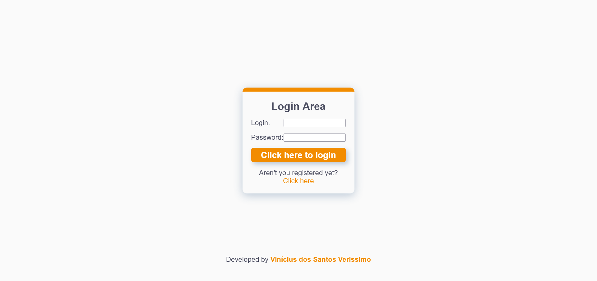

# Simple Login System using NodeJS and Express for the back-end and React in the front-end

## Overview

### Screenshot

## My proccess

### Built with

-   NodeJS
-   Express
-   HTML5
-   CSS3
-   JavaScript
-   React
-   Axios

### How to use

Firstly, open the terminal and execute 'cd server/' to select the server folder, after that execute 'yarn install' to install de necessary dependencies.

After that, execute 'yarn start' on the terminal to start the server.

Then, open another terminal, travel to the 'client' folder and execute 'yarn install' to install the dependencies used by the client-side.

To open the application on the browser, execute 'yarn start' on the terminal opened in the 'client' folder.

The application have two pages, the first one with inputs to insert login and password, and the second with inputs to register a new user.

The system checks if the inputs are correctly filled and after that searches the list of users to verify if the data entered is correct.

## Author

-   GitHub - Vinícius dos Santos Verissimo (https://github.com/viniciusdsv93)
